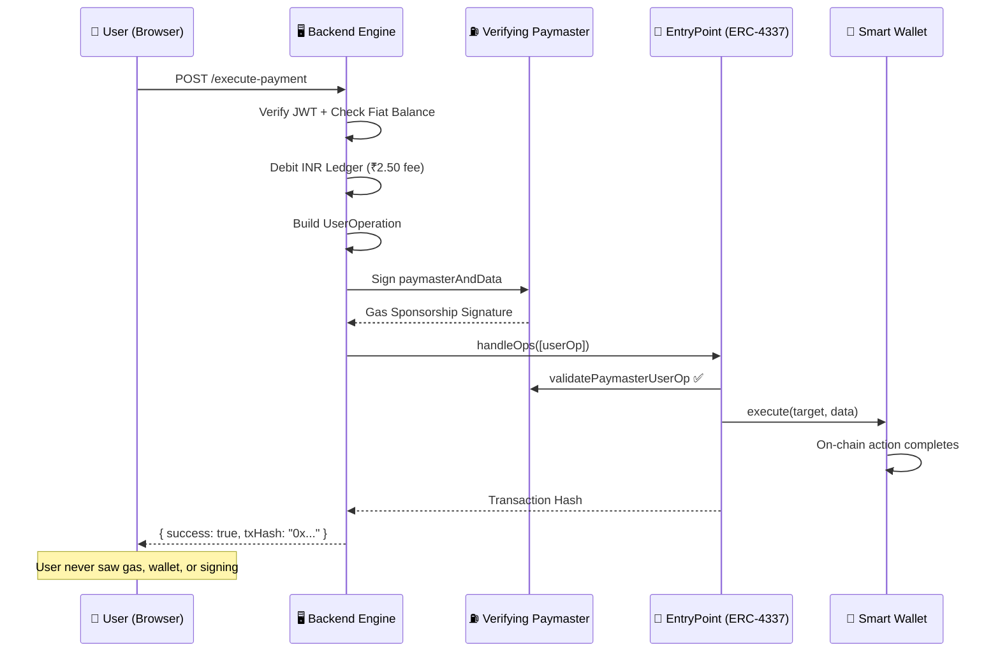

<p align="center">
  
  
  
  
  
</p>

<h1 align="center">
  ◆ Invisible Web3
</h1>

<p align="center">
  <strong>A full-stack Web3 fintech platform that makes blockchain completely invisible to the end user.</strong>
  <br />
  <em>No wallets. No gas fees. No seed phrases. Just seamless digital finance.</em>
</p>

<p align="center">
  <a href="#-architecture">Architecture</a> •
  <a href="#-features">Features</a> •
  <a href="#-tech-stack">Tech Stack</a> •
  <a href="#-getting-started">Getting Started</a> •
  <a href="#-smart-contracts">Smart Contracts</a> •
  <a href="#-project-structure">Project Structure</a> •
  <a href="#-documentation">Documentation</a>
</p>

---

## 🎯 The Problem

Blockchain adoption is bottlenecked by UX friction: users must manage wallets, buy gas tokens, understand transaction signing, and navigate complex DeFi interfaces. **Over 95% of potential users abandon Web3 products at the wallet setup step.**

## 💡 The Solution

**Invisible Web3** abstracts the entire blockchain layer behind a familiar fintech interface. Users interact with what feels like a traditional banking app — creating invoices, receiving payments, managing AI agents — while every action is cryptographically settled on-chain via smart contracts on Polygon.

The platform leverages **ERC-4337 Account Abstraction** to deploy smart wallets automatically, sponsor gas fees through a Verifying Paymaster, and execute blockchain transactions without users ever seeing a wallet address or signing a transaction.

---

## 🏗 Architecture

```
┌─────────────────────────────────────────────────────────────────────┐
│                        FRONTEND (Next.js 14)                        │
│  Auth Flow → Dashboard → Invoices → AI Agents → Digital Vault       │
│  Framer Motion • Tailwind CSS • Glassmorphism UI                    │
└──────────────────────────┬──────────────────────────────────────────┘
                           │ REST API + SSE Events
┌──────────────────────────▼──────────────────────────────────────────┐
│                  BACKEND ORCHESTRATION ENGINE                       │
│                                                                     │
│  ┌──────────────┐  ┌───────────────┐  ┌──────────────────────────┐ │
│  │ AuthService  │  │ LedgerService │  │ TransactionOrchestrator  │ │
│  │ (JWT + OTP)  │  │ (Fiat Ledger) │  │ (UserOp Builder)         │ │
│  └──────────────┘  └───────────────┘  └──────────────────────────┘ │
│  ┌──────────────┐  ┌───────────────┐  ┌──────────────────────────┐ │
│  │ AIService    │  │ ProductService│  │ OwnershipService         │ │
│  │ (Policy Eng) │  │ (Invoices)    │  │ (NFT Credentials)        │ │
│  └──────────────┘  └───────────────┘  └──────────────────────────┘ │
│  ┌──────────────┐  ┌───────────────┐  ┌──────────────────────────┐ │
│  │ OnRampService│  │ OffRampService│  │ EmailService (SMTP OTP)  │ │
│  │ (Fiat → USDC)│  │ (USDC → Fiat) │  │                          │ │
│  └──────────────┘  └───────────────┘  └──────────────────────────┘ │
└──────────────────────────┬──────────────────────────────────────────┘
                           │ ethers.js v6
┌──────────────────────────▼──────────────────────────────────────────┐
│                    POLYGON AMOY BLOCKCHAIN                          │
│                                                                     │
│  ┌─────────────────┐  ┌──────────────────┐  ┌───────────────────┐  │
│  │ EntryPoint       │  │ SimpleAccount    │  │ Verifying         │  │
│  │ (ERC-4337)       │  │ Factory          │  │ Paymaster         │  │
│  └─────────────────┘  └──────────────────┘  └───────────────────┘  │
│  ┌─────────────────┐  ┌──────────────────┐  ┌───────────────────┐  │
│  │ PayoutManager   │  │ PlatformTreasury │  │ MockUSDC          │  │
│  │ (Escrow)        │  │ (Revenue Pool)   │  │ (Test Stablecoin) │  │
│  └─────────────────┘  └──────────────────┘  └───────────────────┘  │
│  ┌─────────────────┐  ┌──────────────────┐                         │
│  │ AIAgentWallet   │  │ Digital          │                         │
│  │ Factory         │  │ Credential (721) │                         │
│  └─────────────────┘  └──────────────────┘                         │
└─────────────────────────────────────────────────────────────────────┘
```

### The "Invisible" Transaction Flow



---

## ✨ Features

### 🏦 Layer 1: Invisible Banking
- **Automatic Smart Wallet Deployment** — CREATE2 deterministic addresses generated from user identity
- **Gas-Free Transactions** — Verifying Paymaster sponsors all gas via ERC-4337
- **Fiat Ledger System** — PostgreSQL/SQLite-backed INR balance tracking
- **Real-Time Dashboard** — SSE-powered live updates across all connected clients

### 💸 Layer 2: Global Payment Infrastructure
- **Invoice & Escrow System** — Create invoices, share payment links, receive global USDC
- **Public Payment Portal** — Clients pay invoices without creating an account
- **P2P Fiat On-Ramp** — INR → USDC via admin-verified UPI transfers (no third-party gateway dependency)
- **P2P Fiat Off-Ramp** — USDC → INR withdrawal to any UPI ID with dynamic exchange rates
- **Platform Treasury** — Smart contract holding revenue with 1% structural fee

### 🤖 Layer 3: Autonomous AI Economy
- **AI Agent Wallets** — Dedicated smart wallets for AI agents with dual-guardrail security
- **On-Chain Spending Limits** — `maxPerTxLimit` enforced at the smart contract level
- **Backend Policy Engine** — Off-chain `dailyBudget` enforcement before gas sponsorship
- **Autonomous Execution** — AI agents sign and broadcast their own transactions

### 🛡 Layer 4: Digital Ownership & Trust
- **Verifiable Credentials** — ERC-721 NFTs for certificates, memberships, and badges
- **Soulbound Tokens** — Non-transferable credentials anchored to user identity
- **Authorized Issuer Pattern** — ECDSA signature verification for trusted minting
- **Digital Vault** — Dashboard tab displaying all on-chain verified assets

### 🔐 Authentication & Security
- **Email/Mobile + Password + OTP** — Dual-factor authentication with bcrypt hashing
- **JWT Session Management** — 24-hour expiry with automatic refresh
- **Real Email OTP Delivery** — Production SMTP integration with branded HTML templates
- **Profile & KYC Management** — Account linking, verification status, and identity management

---

## 🛠 Tech Stack

| Layer | Technology | Purpose |
|-------|-----------|---------|
| **Frontend** | Next.js 14 (App Router) | Server-side rendering, file-based routing |
| **Styling** | Tailwind CSS + Glassmorphism | Premium dark-mode fintech UI |
| **Animations** | Framer Motion | Page transitions, micro-interactions |
| **Typography** | Geist Font | Modern, clean typeface |
| **Backend** | Express.js 5 + TypeScript | RESTful API + SSE event bus |
| **Database** | SQLite (dev) / PostgreSQL (prod) | User data, ledger, invoices |
| **ORM** | Prisma | Type-safe database access |
| **Auth** | JWT + bcrypt + OTP | Dual-factor authentication |
| **Email** | Nodemailer (Gmail SMTP) | OTP delivery with HTML templates |
| **Blockchain** | Polygon Amoy Testnet | EVM-compatible L2 |
| **Smart Contracts** | Solidity ^0.8.20 | ERC-4337, ERC-20, ERC-721 |
| **Contract Framework** | Hardhat | Compilation, deployment, testing |
| **Web3 Library** | ethers.js v6 | Provider, signers, contract interaction |
| **Account Abstraction** | ERC-4337 | Smart wallets, paymasters, bundlers |
| **Logging** | Winston | Structured production telemetry |
| **Tunneling** | Ngrok / Cloudflare | Public demo URL for testing |

---

## 🚀 Getting Started

### Prerequisites

- **Node.js** ≥ 18.x
- **npm** ≥ 9.x
- **Git**

### 1. Clone the Repository

```bash
git clone https://github.com/Zenkairow/Invisible-Web3.git
cd Invisible-Web3
```

### 2. Install Dependencies

```bash
# Backend
cd backend
npm install
npx prisma generate
npx prisma db push
cd ..

# Frontend
cd frontend
npm install
cd ..

# Smart Contracts (optional — only needed for redeployment)
cd smart-contracts
npm install
cd ..
```

### 3. Configure Environment Variables

```bash
cp backend/.env.example backend/.env
```

Edit `backend/.env` with your values:

```env
DATABASE_URL="file:./dev.db"               # SQLite for development
VERIFYING_SIGNER_PRIVATE_KEY="0x..."        # Backend signer for gas sponsorship
BUNDLER_PRIVATE_KEY="0x..."                 # Bundler key for UserOp submission
DEPLOYER_PRIVATE_KEY="0x..."                # Contract deployer key
NETWORK="amoy"                              # local | amoy | mainnet
RPC_URL="https://polygon-amoy.drpc.org"     # Polygon Amoy RPC
PORT=3000
JWT_SECRET="your-secure-secret"
SMTP_HOST="smtp.gmail.com"                  # For OTP email delivery
SMTP_PORT=465
SMTP_USER="your-email@gmail.com"
SMTP_PASS="your-app-password"
```

### 4. Build & Run

```bash
# Build backend
cd backend && npm run build && cd ..

# Build frontend
cd frontend && npm run build && cd ..

# Start everything (backend + frontend + tunnel)
node demo.js
```

The orchestrator will launch:
- **Backend API** → `http://localhost:3000`
- **Frontend App** → `http://localhost:3001`
- **Public Tunnel** → Auto-generated URL (or Ngrok permanent URL if configured)

### 5. Test Login

| Field | Value |
|-------|-------|
| Email | `admin@invisibleweb3.com` |
| Password | `admin@12345` |
| OTP | `199991` (dev bypass) |

---

## 📜 Smart Contracts

All contracts are deployed on **Polygon Amoy Testnet** and verified.

| Contract | Address | Purpose |
|----------|---------|---------|
| **EntryPoint** | `0x5FF137D4b0FDCD49DcA30c7CF57E578a026d2789` | ERC-4337 singleton (standard) |
| **SimpleAccountFactory** | `0x03f07E08C5A3148436EbA152a3EDd50f04BCa063` | Deterministic smart wallet deployer |
| **VerifyingPaymaster** | `0x61D954EA69Ac7DB909529A3Ee3c965611ed59750` | Gas fee sponsor |
| **PayoutManager** | `0x9847F00A01d478e914CcA76A51F9112C10B1aEDB` | Invoice escrow (USDC) |
| **PlatformTreasury** | `0x7A972B5B25901Dd27F191937782AE431a115d099` | Revenue & liquidity pool |
| **MockUSDC** | `0xC598Fb7D5D0a7FA4823dC51388b467d23b2F885c` | Test stablecoin (6 decimals) |
| **AIAgentWalletFactory** | `0xd5c11D0166A6dEbe158aC5315cA6DF88738D8A8e` | AI agent wallet deployer |
| **DigitalCredential** | `0x6c76975947255c86A3d84c535CAfaFF124F3e5F8` | Soulbound NFT credentials (ERC-721) |
| **DummyTarget** | `0x3f684E84AD5159f4F7aAd3F80d739b619C6C2Ee4` | Test execution target |

### Contract Highlights

<details>
<summary><strong>VerifyingPaymaster.sol</strong> — Gas Sponsorship</summary>

Implements the ERC-4337 paymaster interface. Validates that each `UserOperation` contains a valid ECDSA signature from the trusted backend signer before agreeing to pay gas fees. This completely removes the concept of "gas" from the user experience.
</details>

<details>
<summary><strong>AIAgentWallet.sol</strong> — Dual-Guardrail AI Wallets</summary>

Custom smart wallet that accepts signatures from either the human owner OR an authorized AI agent. Enforces a hard `maxPerTxLimit` on-chain. Combined with the backend's `dailyBudget` policy engine, this creates a two-layer security model for autonomous AI spending.
</details>

<details>
<summary><strong>DigitalCredential.sol</strong> — Soulbound Credentials</summary>

ERC-721 NFT contract with an Authorized Issuer pattern. The backend signs credential metadata with ECDSA; the smart contract verifies the signature on-chain during minting. Supports Soulbound mode via `_beforeTokenTransfer` hook override, preventing credential transfers.
</details>

<details>
<summary><strong>PayoutManager.sol</strong> — USDC Escrow</summary>

Manages the full lifecycle of freelancer invoices: funding (client deposits USDC), release (freelancer claims), and cancellation (dispute resolution). All operations are keyed to unique invoice IDs and restricted to the backend orchestrator.
</details>

---

## 📁 Project Structure

```
invisible-web3/
├── backend/                          # Express.js Backend Orchestration Engine
│   ├── prisma/
│   │   └── schema.prisma            # Database schema (8 models)
│   ├── src/
│   │   ├── config/
│   │   │   ├── addresses.ts          # Deployed contract address registry
│   │   │   └── addresses_real_usdc.ts # Production USDC addresses (future)
│   │   ├── middleware/
│   │   │   └── authMiddleware.ts     # JWT Bearer token validation
│   │   ├── services/
│   │   │   ├── AuthService.ts        # Signup, login, OTP, JWT
│   │   │   ├── EmailService.ts       # SMTP OTP with branded HTML
│   │   │   ├── ledgerService.ts      # Fiat balance CRUD
│   │   │   ├── ProductService.ts     # Invoice & escrow lifecycle
│   │   │   ├── AIService.ts          # AI agent policy engine
│   │   │   ├── OwnershipService.ts   # NFT credential minting
│   │   │   ├── TransactionOrchestrator.ts  # UserOp builder & bundler
│   │   │   ├── signingService.ts     # Paymaster signature generation
│   │   │   ├── OnRampService.ts      # Fiat → USDC bridge
│   │   │   ├── OffRampService.ts     # USDC → Fiat bridge
│   │   │   ├── FiatDepositService.ts # P2P deposit management
│   │   │   ├── FiatWithdrawalService.ts # P2P withdrawal management
│   │   │   ├── CryptoPayoutService.ts   # On-chain USDC transfers
│   │   │   └── GatewayService.ts     # External payment gateway
│   │   ├── utils/
│   │   │   ├── logger.ts            # Winston structured logging
│   │   │   └── provider.ts          # Static network RPC provider
│   │   └── index.ts                 # Express app (30+ API endpoints)
│   ├── .env.example                 # Environment variable template
│   ├── package.json
│   └── tsconfig.json
│
├── frontend/                         # Next.js 14 Frontend Application
│   ├── src/
│   │   ├── app/
│   │   │   ├── auth/page.tsx         # Multi-step auth (4 stages)
│   │   │   ├── dashboard/page.tsx    # Bento grid dashboard (4 tabs)
│   │   │   ├── profile/page.tsx      # Profile & KYC management
│   │   │   ├── invoice/[id]/page.tsx # Public payment portal
│   │   │   ├── page.tsx             # Root redirect
│   │   │   ├── layout.tsx           # App layout + AuthProvider
│   │   │   └── globals.css          # Tailwind + custom styles
│   │   └── context/
│   │       └── AuthContext.tsx       # Global auth state + API client
│   ├── next.config.mjs              # API proxy configuration
│   ├── tailwind.config.ts
│   └── package.json
│
├── smart-contracts/                  # Hardhat Smart Contract Suite
│   ├── contracts/
│   │   ├── SimpleAccountFactory.sol  # CREATE2 smart wallet deployer
│   │   ├── VerifyingPaymaster.sol    # ERC-4337 gas sponsor
│   │   ├── PayoutManager.sol         # USDC invoice escrow
│   │   ├── PlatformTreasury.sol      # Revenue holding contract
│   │   ├── MockUSDC.sol              # Test ERC-20 stablecoin
│   │   ├── AIAgentWallet.sol         # Dual-guardrail AI wallet
│   │   ├── AIAgentWalletFactory.sol  # AI wallet deployer
│   │   ├── DigitalCredential.sol     # Soulbound ERC-721 NFTs
│   │   ├── DummyTarget.sol           # Test execution target
│   │   └── MockEntryPoint.sol        # Local testing EntryPoint
│   ├── scripts/
│   │   └── deploy.ts                # Deployment script
│   ├── hardhat.config.ts
│   └── package.json
│
├── docs/                             # Technical Documentation
│   ├── technical_dossier.md          # Deep-dive architecture document
│   ├── project_log.md               # Chronological development log
│   └── V2_Roadmap.md                # Future development plans
│
├── demo.js                          # One-command orchestrator
├── start-remote-demo.bat            # Windows quick-start script
├── docker-compose.yml               # PostgreSQL for production
└── .gitignore
```

---

## 📖 Documentation

| Document | Description |
|----------|-------------|
| [`docs/technical_dossier.md`](docs/technical_dossier.md) | Complete architecture deep-dive: ERC-4337 flow, layer breakdown, data models, security patterns |
| [`docs/project_log.md`](docs/project_log.md) | Chronological development log with timestamps, technical decisions, and phase completions |
| [`docs/V2_Roadmap.md`](docs/V2_Roadmap.md) | Future development plans and feature roadmap |

---

## 🔐 Security Considerations

- **Private Keys** — All blockchain keys are stored in `.env` files, excluded from version control
- **Password Hashing** — bcrypt with 12 salt rounds
- **JWT Tokens** — Signed with environment-configured secret, 24-hour expiry
- **OTP Verification** — 5-minute expiry, single-use, auto-invalidation of previous codes
- **Smart Contract Access Control** — Only authorized signers can trigger escrow releases, credential minting, and paymaster sponsorship
- **Soulbound Enforcement** — Transfer restrictions enforced at the Solidity level, not just the API
- **Admin Endpoints** — Protected by both JWT authentication and admin role middleware

> ⚠️ **Note**: This project uses testnet keys and a development OTP bypass (`199991`) for demonstration. Production deployment requires real key management (e.g., AWS KMS), proper OTP delivery, and formal security auditing.

---

## 🗺 Development Journey

This project was built iteratively over **19 phases**, from a blank Hardhat project to a full-stack fintech platform:

| Phase | Milestone |
|-------|-----------|
| 1-2 | Smart Account Factory + Verifying Paymaster (ERC-4337) |
| 3-4 | Backend Orchestration Engine + Unified Transaction Flow |
| 5 | Next.js 14 Frontend with Premium Fintech UI |
| 6 | Invoice & Escrow System (Freelancer Payouts) |
| 7 | Autonomous AI Agent Economy (Dual-Guardrail Wallets) |
| 8 | Digital Credential Vault (Soulbound ERC-721) |
| 9 | Multi-Network Migration (Polygon Amoy) |
| 10 | Authentication Overhaul (Email + Password + OTP) |
| 11 | Public Payment Portal (Client On-Ramp) |
| 13 | Transak Fiat Integration |
| 14 | Production Migration (Real USDC) |
| 15-16 | P2P UPI On-Ramp & Off-Ramp (No Gateway Dependency) |
| 17-18 | Production Cleanup + Demo Infrastructure |
| 19 | Authentication Optimization + RPC Resilience |

> For the full story with technical details, challenges, and design decisions, see [`docs/project_log.md`](docs/project_log.md).

---

## 🧪 API Reference

<details>
<summary><strong>Public Endpoints (No Authentication)</strong></summary>

| Method | Endpoint | Description |
|--------|----------|-------------|
| `POST` | `/auth/signup` | Register with email/mobile + password |
| `POST` | `/auth/login-step1` | Verify password, send OTP |
| `POST` | `/auth/login` | Complete login with password + OTP |
| `POST` | `/auth/send-otp` | Send/resend OTP |
| `POST` | `/auth/verify-otp` | Verify OTP code |
| `GET` | `/public/invoices/:id` | View invoice details (public) |
| `POST` | `/webhooks/onramp-success` | Payment gateway webhook |
| `GET` | `/events` | SSE real-time event stream |

</details>

<details>
<summary><strong>Protected Endpoints (JWT Required)</strong></summary>

| Method | Endpoint | Description |
|--------|----------|-------------|
| `GET` | `/profile` | Get user profile |
| `PUT` | `/profile` | Update profile (name, UPI) |
| `POST` | `/profile/link-account` | Link email ↔ mobile |
| `GET` | `/balance` | Get fiat balance + wallet address |
| `GET` | `/dashboard-data` | Aggregated dashboard data (single request) |
| `POST` | `/create-invoice` | Create a new invoice |
| `GET` | `/invoices` | List user's invoices |
| `POST` | `/release-invoice` | Claim & release funded invoice |
| `POST` | `/withdraw` | Off-ramp USDC → INR |
| `POST` | `/create-ai-agent` | Deploy an AI agent wallet |
| `GET` | `/ai-agents` | List user's AI agents |
| `POST` | `/simulate-ai-action` | Execute AI agent transaction |
| `POST` | `/issue-credential` | Mint a soulbound credential |
| `GET` | `/credentials` | List user's credentials |
| `POST` | `/execute-payment` | Execute a sponsored blockchain transaction |

</details>

---

## 👤 Author

**Ayush Patil**
- Final Year B.Tech Student
- GitHub: [@Zenkairow](https://github.com/Zenkairow)

---

## 📄 License

This project is licensed under the MIT License — see the [LICENSE](LICENSE) file for details.

---

<p align="center">
  <strong>Built with ☕ and a vision to make Web3 invisible.</strong>
</p>
